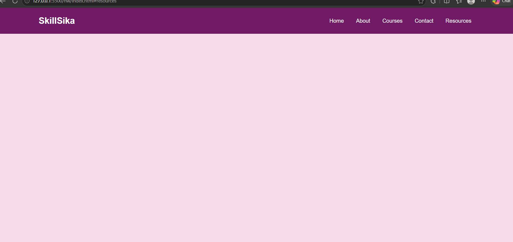
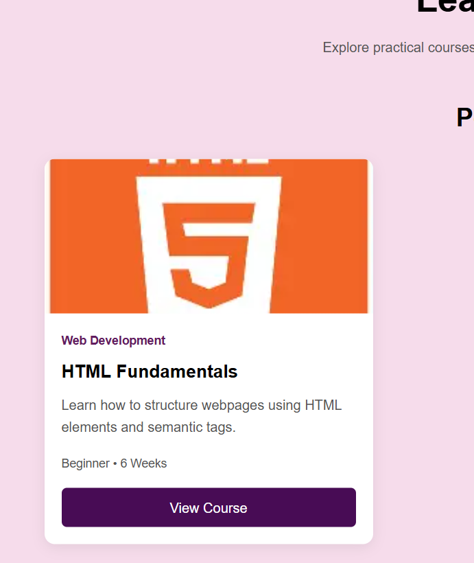
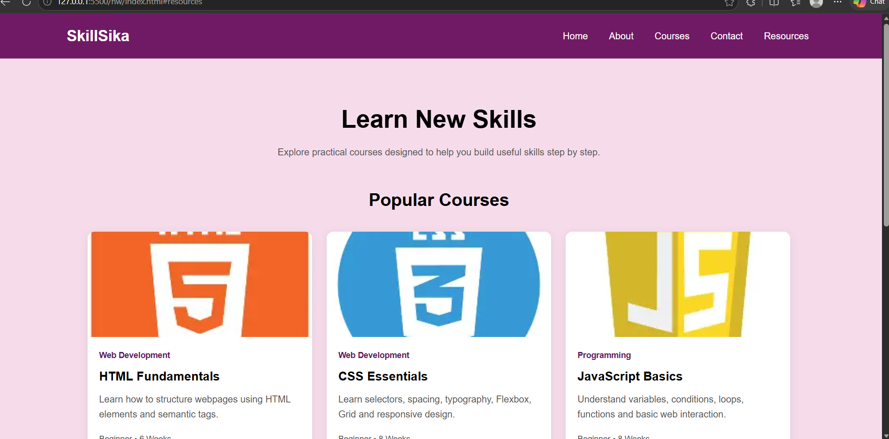
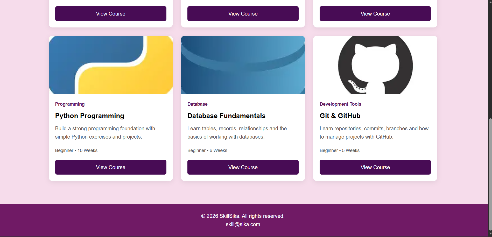
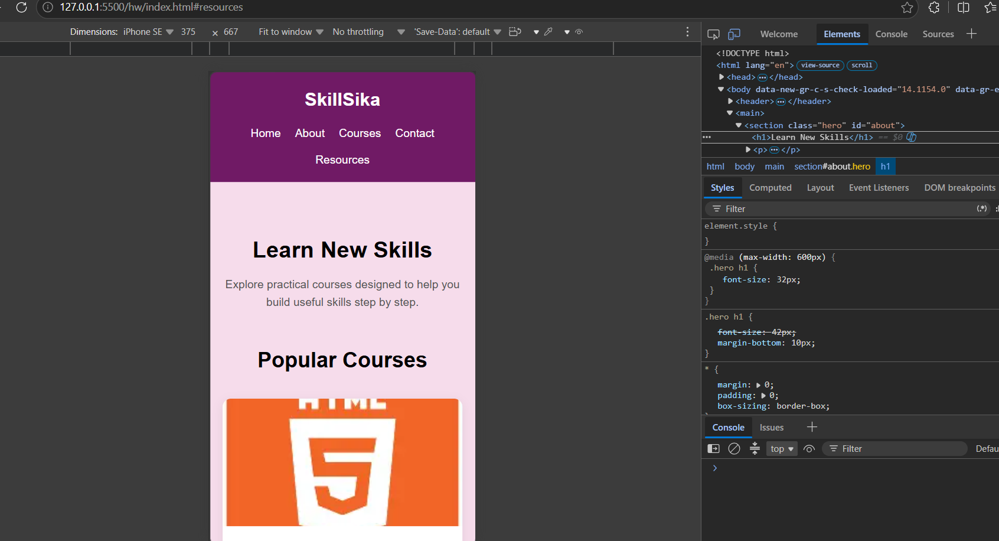
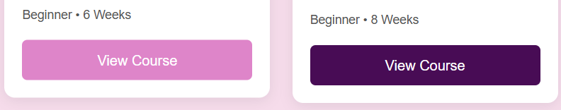

HTML & CSS — Navigation Bar and Card Design

Name: Sujita Maharjan
Student ID: 2602412407
Course: BSc (Hons) Software Engineering 
Level: 4
Assignment: HTML & CSS Practical Assignment

 
Project Description

For this assignment, I created a small learning website called SkillSika using HTML and CSS. The website contains a navigation bar, an introduction section, and six course cards. Each card contains an image, course name, description, category, course duration, and a button.

I also made the website responsive so that the cards change from three columns on desktop, to two columns on tablet, and one column on mobile.

Technologies Used

- HTML5
- CSS3
- CSS Flexbox
- CSS Grid
- Media Queries
- Responsive Web Design

 Resources

1. Teacher's lecture: I learned HTML structure and used header, nav, section, article, and footer to organize my webpage.

2. University learning material: I learned CSS basics such as selectors, colors, spacing, margin, padding, and typography and used them to style my webpage.

3. W3Schools: I learned Flexbox and CSS Grid and used Flexbox for the navigation bar and Grid for the course cards.

4. YouTube tutorial: I learned responsive design using media queries and used them to make my website work on desktop, tablet, and mobile.

Screenshots

1. Navigation Bar

2. Card Design

3. Card Layout

4. Card Layout2

5.Responsive Design

6. Hover Effect

Key Concepts Learned

1. Semantic HTML: I learned how semantic elements help organize the structure of a webpage.
2. CSS Selectors: I learned how selectors are used to style different HTML elements.
3. Box Model: I learned how margin, padding, borders, and content affect the layout.
4. Flexbox:I learned how to align and arrange elements using Flexbox.
5. CSS Grid: I learned how to arrange cards into rows and columns.
6. Typography: I learned how font size, font weight, and text spacing affect the appearance of a webpage.
7. Spacing: I learned how margin and padding can be used to create proper spacing.
8. Hover Effects: I learned how to change an element's appearance when the mouse is placed over it.
8. Responsive Design: I learned how media queries can change the layout for different screen sizes.

Challenges and Solutions

Challenge 1 – Responsive Layout

I initially had difficulty making the cards fit properly on different screen sizes. I solved this by using CSS Grid and media queries to show three cards on desktop, two on tablet, and one on mobile.

Challenge 2 – Navigation Alignment

I had some difficulty aligning the logo and navigation links properly. I solved this by using Flexbox with display flex, justify-content, and align-items.

GitHub Repository

GitHub Repository: (https://github.com/maharjansujitaaa/htmlcss)